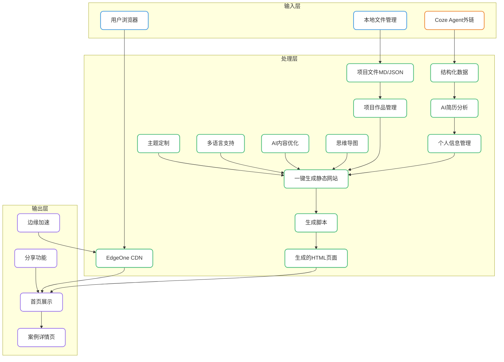

# EasyFolio -产品PRD

## 1. 产品概述
### 定位
一个轻量级的个人简历作品集生成工具，在利用平台AI的能力来简化开发工作的同时，为用户提供快速创建专业个人展示网页的解决方案，通过精美的视觉设计和流畅的交互体验，帮助用户展示个人项目案例、专业技能和工作经验，适合通过社媒/电商平台分享。

### 核心价值
- **AI驱动的高效创作**：利用平台AI能力自动分析优化简历内容，快速完成从简历到专业作品集的转化，告别繁琐的手动排版和内容整理
- **轻量化**：无需复杂后端配置，一键生成静态网站快速部署，适合非技术用户
- **专业展示**：现代化设计语言，提供沉浸式案例展示体验，提升求职机会
- **免费使用**：个人用户可零成本部署
- **体验卓越**：丰富的交互动画和响应式设计，提供优质用户体验
- **完整生态**：从前端展示到后端数据管理的完整解决方案

### 目标用户
- **应届毕业生等求职者**：需要专业的简历和作品集提高求职竞争力
	痛点：缺乏作品集制作经验，时间紧张，预算有限，需要低成本高效的解决方案；需要重新包装技能和经验突出个人优势
- **内容创作者**：需要通过作品集展示专业能力吸引客户
	痛点 ：缺乏技术能力搭建网站，传统作品集制作耗时，难以突出个人特色

### 目标用户共同特征
- 技术背景 ：多为非技术或技术基础有限的用户，需要零代码或低代码解决方案
- 时间需求 ：希望快速完成作品集创建，节省时间用于核心业务或学习
- 预算考虑 ：倾向于低成本或免费解决方案，避免高额开发和设计费用
- 分享需求 ：需要方便地分享作品到社交媒体、招聘平台或客户
- 专业追求 ：希望展示效果专业美观，提升个人品牌形象
### 用户场景示例
- 场景1 ：自由设计师接到新客户咨询，需要快速分享作品集链接，通过EasyFolio生成的专业网页获得客户信任
- 场景2 ：应届毕业生准备求职，通过EasyFolio将实习经验和项目作品整合成专业作品集，在面试中脱颖而出
- 场景3 ：转行人士准备面试新岗位，通过EasyFolio重构个人经历，突出与新岗位相关的技能和项目
- 场景4 ：斜杠青年需要在社交媒体分享个人品牌，通过EasyFolio创建整合多元技能的展示页面，吸引合作机会

## 2. 核心功能
### 功能模块

| 模块           | 功能描述                                  | 优先级 | 状态   | 亮点                                 | 痛点                |     |
| ------------ | ------------------------------------- | --- | ---- | ---------------------------------- | ----------------- | --- |
| **AI简历分析**   | 提供Coze Agent链接，用户跳转进行简历分析，返回结构化数据模板   | P0  | 开发中  | 利用平台AI能力，减少本地开发工作量，自动保存无需手动输入      | 依赖网络连接，分析准确性需持续优化 |     |
| **项目作品管理**   | 添加、编辑、删除项目案例，支持项目描述、技术栈、成果展示、链接等信息展示  | P0  | 部分实现 | 灵活的项目组织，支持多维度展示，本地文件管理、JSON/MD格式支持 | 需要手动编辑文件，不够直观     |     |
| **一键生成静态网站** | 基于用户数据生成静态HTML网站                      | P0  | 已完成  | 零技术门槛，5分钟完成部署                      | 生成速度和文件大小需优化      |     |
| **个人信息管理**   | 通过本地配置文件编辑个人基本信息，包括姓名、职位、联系方式等        | P0  | 未实现  | 本地文件管理，简单直接                        | 后期需要手动编辑文件，不够直观   |     |
| **首页展示**     | 个人简介、技能展示、案例预览                        | P0  | 已实现  | 3D翻转效果、手风琴式布局、自动轮播                 | 内容固定，需要手动更新       |     |
| **多语言支持**    | 中英文切换、内容国际化                           | P0  | 已实现  | 实时切换、HTML标签支持                      | 仅支持中英文            |     |
| **交互体验**     | 滚动动画、悬停效果、页面过渡                        | P0  | 已实现  | 流畅的动画效果、响应式设计、页面跳转动画               | 动画性能优化空间          |     |
| **主题定制**     | 通过预设主题文件夹和图片资源进行管理，支持主题切换             | P1  | 开发中  | 文件+图片形式管理，简单直接                     | 主题定制灵活性需提升        |     |
| **AI内容优化**   | 利用AI生成或优化个人简介、项目描述等内容                 | P1  | 待开发  | 专业内容建议，提升展示效果                      | 内容个性化程度需加强        |     |
| **分享功能**     | 生成可分享的链接，支持直接分享到社交媒体和电商平台             | P1  | 待开发  | 一键分享，扩大作品影响力                       | 分享统计和效果跟踪功能需完善    |     |
| **思维导图**     | 案例可视化、思维结构展示、项目流程呈现                   | P1  | 开发中  | Obsidian Canvas集成、项目结构可视化          | 集成复杂度较高，需优化用户体验   |     |
| **数据统计**     | 访客量、浏览时长、页面热度                         | P2  | 部分实现 | 基础访问统计、案例浏览记录                      | 数据可视化不足           |     |
| **内容导入导出**   | 支持从LinkedIn、GitHub等平台导入数据，导出为PDF或其他格式 | P2  | 待开发  | 数据迁移便捷，提高工作效率                      | 第三方平台API集成需持续维护   |     |
| **边缘加速**     | 全球CDN加速、边缘计算                          | P2  | 部份实现 | EdgeOne Pages部署、毫秒级访问              | 配置复杂度较高           |     |

### 页面详情

#### 3.1 首页
##### 3.1.1 页面结构
- **导航栏**：Logo、导航链接（首页、案例、关于我）、语言切换按钮、移动端菜单按钮、主题切换按钮
- **Hero区域**：个人简介、职业标签、技能卡片、能力雷达、CTA按钮
- **案例展示区域**：手风琴式案例卡片、案例导航指示器、自动轮播
- **方法论区域**：工作流程、核心能力展示
- **联系区域**：联系方式、社交媒体链接

##### 3.1.2 核心功能
- **个人展示**：显示用户姓名、个人简介
- **技能展示**：通过技能卡片展示专业技能和技术栈
- **案例预览**：手风琴式布局展示案例缩略图和基本信息
- **语言切换**：支持中英文实时切换
- **响应式设计**：适配桌面端、平板和移动设备，采用网格布局和弹性盒模型
- **主题切换**：通过选择不同主题实现切换
##### 3.1.3 交互效果
- **滚动动画**：元素进入视口时的淡入效果
- **悬停效果**：卡片和按钮的悬停状态变化
- **手风琴交互**：点击案例卡片展开详细信息
- **页面过渡**：页面跳转时的平滑过渡动画
- **返回顶部**：滚动时显示返回顶部按钮

#### 3.2 案例详情页
##### 3.2.1 页面结构
- **布局**：侧边栏导航 + 主内容区
- **案例头部**：案例编号、项目名称、主标题、标签
- **案例内容**：挑战、解决方案、实施方法、成果展示
- **案例标签**：技术栈、关键词标签
- **思维导图区域**：项目结构可视化展示，时间线
- **项目选择器**：侧边栏项目导航，相关案例推荐
- **页脚**：返回首页链接

##### 3.2.2 核心功能
- **案例详情展示**：详细的项目描述、实施过程和成果
- **标签筛选**：通过标签筛选相关案例
- **思维导图可视化**：项目结构和流程的直观展示
- **项目导航**：快速切换不同案例
- **多语言支持**：案例内容的中英文切换

##### 3.2.3 交互效果
- **标签交互**：点击标签筛选相关案例
- **思维导图交互**：支持缩放、拖拽等操作
- **页面跳转动画**：平滑的页面切换效果
- **返回顶部**：滚动时显示返回顶部按钮
  

## 3. 技术架构
### 技术栈分析
| 类别   | 技术                | 版本   | 用途            | 评估             |
| ---- | ----------------- | ---- | ------------- | -------------- |
| 前端   | HTML5 + CSS3 + JS | ES6+ | 页面结构和交互       | 标准技术，成熟稳定      |
| 边缘层  | EdgeOne Pages     | -    | CDN加速和边缘计算    | 全球节点，访问速度快     |
| 后端   | 腾讯云云开发            | -    | Serverless云函数 | 免费额度充足，配置简单    |
| 数据库  | MongoDB           | -    | 文档存储          | 灵活的数据结构，适合案例管理 |
| 数据格式 | JSON              | -    | 案例数据存储        | 结构清晰，易于解析      |
| 数据格式 | Markdown          | -    | 案例内容管理        | 易于编辑，支持富文本     |
| 可视化  | Obsidian Canvas   | -    | 思维导图生成        | 强大的可视化工具       |
| 部署   | GitHub Pages      | -    | 代码托管          | 免费，易于控制与使用     |
| 案例生成 | Node.js           | -    | 静态网站生成        | 轻量级，易于部署       |
| AI分析 | Coze Agent (外部链接) | -    | 简历分析和内容优化     | 利用平台能力，减少本地开发  |
| 部署   | Vercel            | -    | 静态网站托管        | 速度快，配置简单       |

### 系统架构

### 部署流程
1. **准备阶段**：整理项目文件，编辑配置和案例文件
2. **生成静态文件**：运行生成脚本，生成HTML页面
3. **部署上线**：将生成的文件部署到选择的平台
   - **GitHub Pages**：推送代码到GitHub仓库，开启Pages功能
   - **Vercel**：导入GitHub仓库，自动部署
   - **EdgeOne Pages**：上传静态文件，配置边缘加速
4. **验证测试**：检查网站功能和响应式效果
5. **分享推广**：分享网站链接到社交媒体和职业平台

### 技术优化建议

#### 前端优化
1. **性能优化**
   - 实现图片懒加载，减少初始加载时间
   - 代码压缩和资源合并，减少HTTP请求
   - 实现资源缓存策略，提高重复访问速度
   - 优化动画性能，使用CSS transform和opacity

2. **交互体验**
   - 添加骨架屏，减少用户等待感
   - 实现平滑滚动，提升页面导航体验
   - 增强移动端交互，优化触摸体验
   - 优化页面过渡动画，确保流畅性

3. **可访问性**
   - 添加ARIA标签，提高屏幕阅读器兼容性
   - 实现键盘导航支持，提升无障碍访问
   - 优化颜色对比度，提高可读性

#### 生成器优化
1. **性能优化**
   - 优化文件解析逻辑，提高生成速度
   - 实现增量生成，只处理修改的文件
   - 缓存生成结果，避免重复计算

2. **功能增强**
   - 支持更多文件格式，如YAML、TOML等
   - 实现模板系统，支持自定义页面结构
   - 添加错误处理和日志记录，便于调试

#### 部署优化
1. **自动化部署**
   - 配置CI/CD流程，实现自动构建和部署
   - 集成代码质量检查，确保部署质量

2. **边缘加速**
   - 配置EdgeOne Pages，提供全球CDN加速
   - 优化静态资源缓存策略，提高访问速度

## 4. 实施计划

**核心设计理念**：
- **产品化体验**：提供完整的工作流和用户体验，不只是脚本堆砌
- **轻量化架构**：保持代码简洁，无需复杂后端，让用户能理解和修改
- **外部平台赋能**：充分利用成熟的外部服务，避免重复造轮子
- **文档驱动**：用清晰详细的文档降低使用门槛，让非技术用户也能轻松上手

### 4.2 MVP开发阶段
| 阶段 | 时间 | 核心任务 | 交付物 | 验收标准 |
|------|------|---------|--------|----------|
| MVP规划 | 0.5天 | 确定MVP范围，梳理用户旅程 | MVP范围文档 | 明确MVP功能边界 |
| 核心功能整合 | 2天 | 整合已有前端，优化生成脚本 | 可运行的MVP原型 | 核心功能可用 |
| AI集成体验 | 1天 | Coze Agent链接配置，数据格式标准化 | AI分析工作流文档 | 用户能按步骤完成简历分析 |
| 多平台部署支持 | 1天 | 完善4种部署平台的详细指南 | 部署指南文档 | 支持GitHub Pages、Vercel、Netlify、EdgeOne Pages |
| 文档完善 | 1.5天 | 编写用户手册、快速入门、示例项目 | 完整文档体系 | 新用户30分钟内能完成首个作品集 |
| 测试与优化 | 1天 | 功能测试、体验优化、Bug修复 | 测试报告 | 核心流程无阻断性Bug |
| **总计** | **7天** | - | - | - |

### 4.3 功能优化建议

#### 4.3.1 内容管理
1. **工作流优化**
   - 提供详细的文件结构说明和示例
   - 建立内容模板，确保一致性
   - 提供数据校验脚本，避免格式错误

2. **格式规范**
   - 统一JSON/MD文件格式，建立内容标准
   - 提供内容预览示例，减少错误
   - 支持图片和视频的本地管理

#### 4.3.2 外部平台利用
1. **AI分析**：直接使用Coze Agent外部链接，提供清晰的使用流程
2. **部署**：充分利用GitHub Pages、Vercel、Netlify、EdgeOne Pages的官方功能
3. **版本控制**：建议用户使用Git进行版本管理
4. **内容编辑**：推荐用户使用VS Code、Obsidian等工具编辑内容

### 4.4 代码质量与规范

#### 4.4.1 代码规范
| 代码类型 | 命名规范 | 示例 |
|----------|----------|------|
| JavaScript变量 | camelCase | visitorId, currentLang |
| JavaScript常量 | UPPER_SNAKE_CASE | API_BASE_URL |
| JavaScript函数 | camelCase | generateStaticSite() |
| JSON字段 | camelCase | personalInfo, projectList |
| 文件命名 | kebab-case | case-generator.js, config-parser.js |

## 5. MVP产品描述

### 5.1 MVP核心功能
EasyFolio MVP 是一个完整可用的产品，包含以下核心功能：

1. **精美前端展示**
   - 现代化首页：个人简介、技能展示、案例预览
   - 专业案例详情页：完整的项目展示、思维导图
   - 多语言支持：中英文实时切换
   - 响应式设计：完美适配桌面、平板、移动设备
   - 流畅交互：滚动动画、悬停效果、页面过渡

2. **AI简历分析**
   - Coze Agent外部链接集成
   - 结构化数据模板输出
   - 清晰的使用流程指南

3. **内容管理工具**
   - 本地JSON/MD文件管理
   - 项目作品编辑
   - 个人信息配置
   - 主题选择

4. **一键生成静态网站**
   - Node.js生成脚本
   - 快速HTML生成
   - 本地预览支持

5. **多平台部署支持**
   - GitHub Pages部署指南
   - Vercel部署指南
   - Netlify部署指南
   - EdgeOne Pages部署指南

### 5.2 用户旅程
1. **快速入门（10分钟）**
   - 下载EasyFolio
   - 阅读快速入门指南
   - 运行示例项目

2. **创建作品集（30分钟）**
   - 编辑个人信息配置
   - 添加1-2个项目案例
   - 选择喜欢的主题

3. **AI辅助（可选）**
   - 访问Coze Agent
   - 上传简历获取结构化数据
   - 将数据应用到EasyFolio

4. **生成与部署（20分钟）**
   - 运行生成脚本
   - 本地预览效果
   - 选择部署平台，按指南上线

5. **分享与传播**
   - 获取网站链接
   - 分享到社交媒体、招聘平台

### 5.3 MVP成功标准（量化）

| 维度 | 指标 | 目标值 | 测量方式 |
|------|------|--------|----------|
| **功能完整性** | P0功能实现率 | 100% | 功能检查表 |
| **用户体验** | 新用户完成首个作品集时间 | ≤ 30分钟 | 用户测试 |
| **生成性能** | 静态网站生成时间 | ≤ 10秒 | 性能测试 |
| **部署成功率** | 用户按指南成功部署率 | ≥ 90% | 用户测试 |
| **文档质量** | 文档清晰度评分 | ≥ 4.5/5 | 用户调研 |
| **浏览器兼容性** | 主流浏览器兼容 | Chrome、Firefox、Safari、Edge | 兼容性测试 |
| **响应式适配** | 设备适配数量 | ≥ 3种（桌面、平板、手机） | 响应式测试 |
| **代码质量** | 核心代码注释覆盖率 | ≥ 30% | 代码审查 |

## 6. 产品优势

1. **AI驱动高效**：利用Coze Agent外部服务，无需复杂AI开发，快速完成简历分析
2. **专业视觉呈现**：现代化设计语言，3D翻转、手风琴布局、流畅动画，提供沉浸式体验
3. **部署灵活多样**：支持4种主流平台（GitHub Pages、Vercel、EdgeOne Pages），用户可自由选择
4. **零技术门槛**：详细文档+清晰步骤，非技术用户也能快速上手
5. **轻量级架构**：基于静态网站生成，无需复杂后端，代码简洁易理解
6. **边缘加速可选**：EdgeOne Pages提供全球CDN加速，毫秒级访问体验
7. **完整工作流**：从简历分析→内容编辑→生成网站→部署上线，端到端完整体验
8. **可自由扩展**：不做过度封装，用户可根据需要自由修改和扩展

## 7. 风险与应对策略

### 7.1 技术风险
| 风险 | 影响 | 可能性 | 应对策略 |
|------|------|--------|----------|
| Coze Agent 外部依赖 | 需要跳转外部平台 | 中 | 提供详细步骤指南，强调这是产品设计选择，减少开发复杂度 |
| 脚本理解门槛 | 非技术用户理解困难 | 中 | 提供视频教程+图文指南+示例项目，降低学习曲线 |
| 浏览器兼容性 | 功能异常 | 低 | 针对主流浏览器充分测试，提供降级方案 |
| 平台配置失败 | 用户部署受挫 | 中 | 提供3种平台选择，推荐从简单的GitHub Pages开始 |

### 7.2 应对策略
- **文档优先**：将文档作为产品核心部分，提供快速入门、详细指南、常见问题、视频教程
- **示例驱动**：提供3个完整示例项目，用户可直接套用
- **渐进引导**：从简单到复杂，分阶段引导用户掌握
- **社区支持**：建立Discord/微信群，用户互助交流

## 8. 成功标准（详细量化）

### 8.1 功能完整性
- [x] 首页展示功能正常（个人简介、技能卡片、案例预览）
- [x] 案例详情页功能正常（项目展示、思维导图）
- [x] 多语言切换功能正常（中英文实时切换）
- [x] 响应式设计正常（适配桌面、平板、手机）
- [x] 静态网站生成功能正常（生成速度≤10秒）
- [x] Coze Agent使用流程清晰（文档完整）
- [x] 3种部署平台指南完整（GitHub Pages、Vercel、EdgeOne Pages）

### 8.2 用户体验
- 新用户从下载到完成首个作品集时间：≤ 30分钟
- 用户按文档成功部署率：≥ 90%
- 文档清晰度用户评分：≥ 4.5/5
- 核心流程无阻断性Bug
- 页面加载时间：≤ 2秒（首屏）

### 8.3 技术质量
- 主流浏览器兼容性：Chrome、Firefox、Safari、Edge最新版本
- 响应式适配：桌面（1920×1080）、平板（768×1024）、手机（375×667）
- 代码规范：100%符合命名规范
- 核心代码注释覆盖率：≥ 30%

### 8.4 产品完整性
- 快速入门指南：完整可用
- 用户手册：完整可用
- 部署指南：4种平台完整
- 示例项目：≥ 3个完整示例
- 常见问题FAQ：≥ 10个常见问题

## 9. 总结与建议

EasyFolio 是一个**轻量级但完整的个人简历作品集产品**，通过组合精美的前端展示、简洁的工具脚本和强大的外部平台，为用户提供快速创建专业个人展示网页的完整解决方案。

**最终建议**：
1. **MVP优先**：先完成MVP核心功能，确保用户能完成从简历到部署的完整流程
2. **文档即产品**：将文档作为产品核心部分投入资源，这是降低使用门槛的关键
3. **示例驱动**：提供多个高质量示例项目，让用户可以直接参考和套用
4. **快速迭代**：根据用户反馈快速优化，重点关注用户卡住的环节
5. **社区建设**：建立用户社区，让用户互相帮助，分享作品和经验

通过专注于核心体验、优质文档和示例，EasyFolio有潜力成为个人简历作品集领域的标杆产品，帮助更多专业人士展示自己的能力，提升个人品牌价值。

---

**产品名称**：EasyFolio
**版本**：1.0.0 (MVP)
**日期**：2026-03-05
**状态**：MVP开发中
