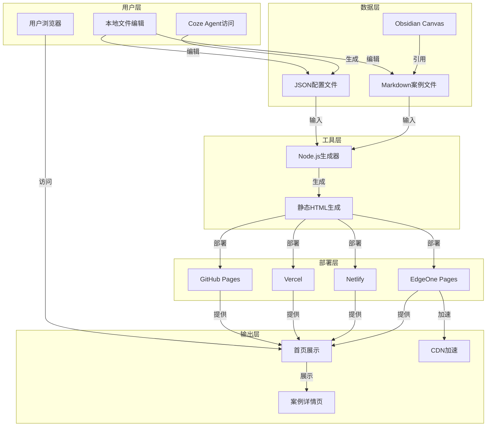
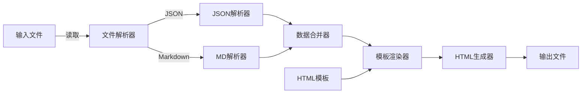
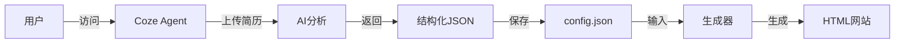
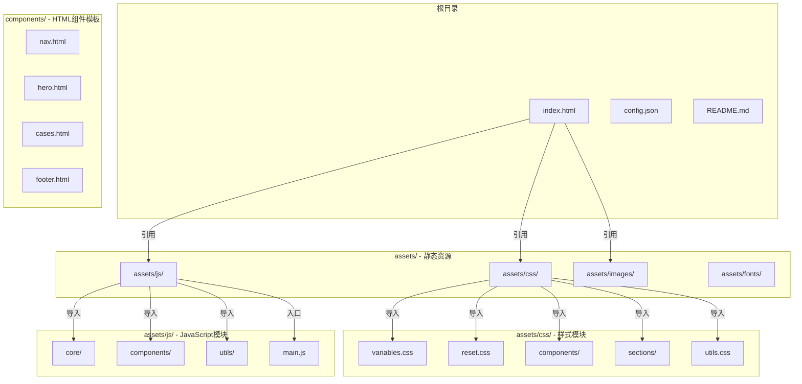
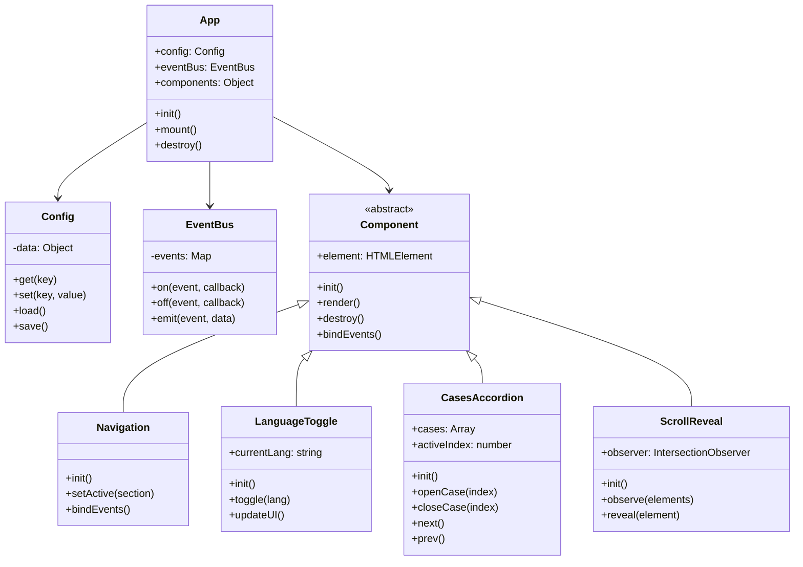

# EasyFolio 技术方案文档

**文档版本**: 1.0  
**创建日期**: 2026-03-05  
**产品名称**: EasyFolio - 个人作品集生成工具

---

## 1. 技术方案概述

### 1.1 设计原则

EasyFolio 遵循以下技术设计原则：

1. **轻量级架构**
   - 基于静态网站生成，无需复杂后端
   - 代码简洁易理解，便于用户修改
   - 最小化依赖，降低维护成本

2. **产品化体验**
   - 提供完整的工作流和用户体验
   - 不只是脚本堆砌，而是完整产品
   - 文档驱动，降低使用门槛

3. **外部平台赋能**
   - 充分利用成熟的外部服务
   - 避免重复造轮子
   - Coze Agent、GitHub Pages、Vercel 等平台集成

4. **可定制性**
   - 不做过度封装
   - 保持代码的可定制性
   - 用户可根据需要自由修改和扩展

---

## 2. 系统架构设计

### 2.1 整体架构



---

## 3. 前端技术方案

### 3.1 技术栈选型

| 技术 | 版本/说明 | 用途 | 选型理由 |
|------|----------|------|---------|
| HTML5 | ES6+ | 页面结构 | 标准技术，成熟稳定，无需框架 |
| CSS3 | CSS Grid + Flexbox | 页面样式 | 响应式布局，现代设计 |
| JavaScript | ES6+ | 交互逻辑 | 原生 JS，无框架依赖 |
| 字体 | Google Fonts | 中文字体 | Noto Sans SC + Syne + Space Mono |

### 3.2 不使用框架的原因

1. **降低学习门槛** - 非技术用户不需要学习框架
2. **简化架构** - 减少复杂度，代码更易理解
3. **性能优化** - 减少框架 overhead，页面加载更快
4. **可定制性** - 用户可直接修改 HTML/CSS/JS

### 3.3 页面结构设计

#### 首页 (index.html)

**页面布局**
```
┌─────────────────────────────────────────┐
│           导航栏 (固定顶部)            │
├─────────────────────────────────────────┤
│                                      │
│           Hero 区域                   │
│  个人简介 + 技能卡片 + CTA按钮        │
│                                      │
├─────────────────────────────────────────┤
│                                      │
│        案例展示区域 (手风琴式)        │
│                                      │
├─────────────────────────────────────────┤
│                                      │
│           方法论区域                  │
│                                      │
├─────────────────────────────────────────┤
│                                      │
│           联系区域                   │
│                                      │
└─────────────────────────────────────────┘
```

**核心功能模块**
1. 导航栏组件
   - Logo 展示
   - 导航链接（首页、案例、关于我）
   - 语言切换按钮
   - 移动端汉堡菜单

2. Hero 区域组件
   - 个人问候语
   - 职业标签
   - 技能卡片展示
   - CTA 按钮

3. 案例展示组件
   - 手风琴式案例卡片
   - 案例导航指示器
   - 自动轮播控制

4. 方法论组件
   - 工作流程展示
   - 核心能力说明

5. 联系组件
   - 联系方式展示
   - 社交媒体链接

#### 案例详情页 (cases/*.html)

**页面布局**
```
┌─────────────────────────────────────────┐
│  侧边栏导航     │     主内容区       │
│                │                     │
│  项目选择器    │   案例头部信息     │
│                │                     │
│  目录大纲      │   挑战/解决方案    │
│                │                     │
│                │   实施方法         │
│                │                     │
│                │   成果展示         │
│                │                     │
│                │   思维导图         │
└─────────────────────────────────────────┘
```

### 3.4 响应式设计方案

#### 断点设计

| 设备类型 | 断点宽度 | 布局调整 |
|---------|---------|---------|
| 桌面端 | ≥ 1024px | 多列网格布局 |
| 平板端 | 768px - 1023px | 中等网格布局 |
| 手机端 | < 768px | 单列流式布局 |

#### CSS Grid + Flexbox 组合方案

```css
/* 桌面端布局 */
@media (min-width: 1024px) {
    .hero {
        grid-template-columns: 1fr 1.2fr;
    }
    .cases-grid {
        grid-template-columns: repeat(3, 1fr);
    }
}

/* 平板端布局 */
@media (min-width: 768px) and (max-width: 1023px) {
    .hero {
        grid-template-columns: 1fr;
    }
    .cases-grid {
        grid-template-columns: repeat(2, 1fr);
    }
}

/* 手机端布局 */
@media (max-width: 767px) {
    .hero {
        grid-template-columns: 1fr;
        padding: 2rem;
    }
    .cases-grid {
        grid-template-columns: 1fr;
    }
    .nav-links {
        display: none;
    }
    .hamburger {
        display: flex;
    }
}
```

### 3.5 交互效果设计

#### 动画系统

**滚动动画 (Scroll Reveal)**
```javascript
// 使用 Intersection Observer API
const observer = new IntersectionObserver((entries) => {
    entries.forEach(entry => {
        if (entry.isIntersecting) {
            entry.target.classList.add('visible');
        }
    });
}, {
    threshold: 0.1
});

// 观察所有 .reveal 元素
document.querySelectorAll('.reveal').forEach(el => {
    observer.observe(el);
});
```

**页面过渡动画**
```javascript
// 页面进入动画
document.addEventListener('DOMContentLoaded', () => {
    document.body.classList.add('page-enter');
});

// 页面离开动画
window.addEventListener('beforeunload', () => {
    document.body.classList.remove('page-enter');
    document.body.classList.add('page-exit');
});
```

**悬停效果**
```css
/* 卡片悬停 */
.skill-card {
    transition: all 0.3s ease;
}

.skill-card:hover {
    transform: translateY(-2px);
    box-shadow: 0 8px 32px rgba(0, 0, 0, 0.1);
}

/* 按钮悬停 */
.btn-primary {
    transition: all 0.2s ease;
}

.btn-primary:hover {
    background: var(--accent);
    transform: translateY(-1px);
}
```

---

## 4. 数据方案设计

### 4.1 数据格式选型

| 格式 | 用途 | 优点 | 缺点 |
|------|------|------|------|
| JSON | 配置文件、结构化数据 | 结构清晰、易于解析、机器友好 | 编辑不够直观 |
| Markdown | 案例内容、长文本 | 易于编辑、支持富文本、人类友好 | 需要解析 |
| Obsidian Canvas | 思维导图、可视化 | 强大的可视化、直观的结构 | 文件格式复杂 |

### 4.2 数据结构设计

#### 配置文件结构 (config.json)

```json
{
  "schema_version": "1.0",
  "personal": {
    "name": "姓名",
    "title": "职位/专业身份",
    "email": "邮箱",
    "phone": "电话",
    "location": "城市, 国家",
    "bio": "个人简介",
    "social": {
      "linkedin": "LinkedIn链接",
      "github": "GitHub链接",
      "portfolio": "作品集链接"
    }
  },
  "education": [
    {
      "institution": "学校名称",
      "degree": "学位",
      "field": "专业",
      "startDate": "2018-09",
      "endDate": "2022-06",
      "description": "在校成就描述"
    }
  ],
  "experience": [
    {
      "company": "公司名称",
      "position": "职位",
      "startDate": "2022-07",
      "endDate": "至今",
      "description": "工作描述",
      "achievements": ["成就1", "成就2"]
    }
  ],
  "skills": [
    {
      "name": "技能名称",
      "level": "入门/进阶/专家",
      "category": "前端/后端/设计/产品/其他"
    }
  ],
  "projects": [
    {
      "id": "project-01",
      "title": "项目名称",
      "description": "项目描述",
      "date": "2023-06",
      "technologies": ["技术1", "技术2"],
      "link": "项目链接",
      "image": "项目封面图片",
      "mindmap": "思维导图文件路径"
    }
  ],
  "theme": "default",
  "config": {
    "language": "zh",
    "analytics": true,
    "edgeAcceleration": false
  }
}
```

#### 案例文件结构 (cases/case-01.json)

```json
{
  "id": "case-01",
  "caseNumber": 1,
  "projectName": "项目名称",
  "mainTitle": "主标题",
  "challenge": "挑战描述",
  "approach": "解决方案",
  "frameworkTitle": "问题解构与能力映射",
  "frameworkItems": [
    {
      "number": "01",
      "title": "标题",
      "description": "描述"
    }
  ],
  "methodologyTitle": "核心实施方案",
  "methodologyItems": [
    {
      "title": "标题",
      "description": "描述",
      "tags": ["标签1", "标签2"]
    }
  ],
  "kpiTitle": "项目交付成果",
  "kpiMetrics": [
    {
      "value": "数值",
      "label": "标签",
      "description": "描述"
    }
  ],
  "allCases": [
    {
      "id": "case-01",
      "projectName": "项目1"
    }
  ]
}
```

### 4.3 数据验证方案

#### 基础验证规则

```javascript
// 数据验证函数
function validateConfig(config) {
  const errors = [];
  
  // 验证 personal
  if (!config.personal?.name) {
    errors.push('个人姓名不能为空');
  }
  if (!config.personal?.title) {
    errors.push('职位不能为空');
  }
  if (!config.personal?.email) {
    errors.push('邮箱不能为空');
  }
  if (!config.personal?.bio) {
    errors.push('个人简介不能为空');
  }
  
  // 验证 skills
  if (config.skills && !Array.isArray(config.skills)) {
    errors.push('技能必须是数组格式');
  }
  
  // 验证 projects
  if (config.projects && !Array.isArray(config.projects)) {
    errors.push('项目必须是数组格式');
  }
  
  return errors;
}
```

---

## 5. 生成器技术方案

### 5.1 技术选型

| 技术 | 版本 | 用途 | 选型理由 |
|------|------|------|---------|
| Node.js | LTS | 运行环境 | 跨平台、生态丰富、轻量级 |
| fs | Node.js 内置 | 文件操作 | 无需额外依赖 |
| path | Node.js 内置 | 路径处理 | 跨平台路径兼容 |

### 5.2 生成器架构设计



### 5.3 核心模块设计

#### 文件解析模块

```javascript
const fs = require('fs');
const path = require('path');

class FileParser {
  constructor(baseDir) {
    this.baseDir = baseDir;
  }
  
  parseJSONFile(filePath) {
    const content = fs.readFileSync(filePath, 'utf-8');
    return JSON.parse(content);
  }
  
  parseMDFile(filePath) {
    const content = fs.readFileSync(filePath, 'utf-8');
    return this.parseMDContent(content);
  }
  
  parseMDContent(content) {
    // 解析 YAML frontmatter
    const frontmatter = this.parseFrontmatter(content);
    // 解析主体内容
    const body = this.parseBody(content);
    return { ...frontmatter, ...body };
  }
  
  parseFrontmatter(content) {
    const match = content.match(/^---\n([\s\S]*?)\n---\n/);
    if (!match) return {};
    
    const frontmatter = {};
    const lines = match[1].split('\n');
    lines.forEach(line => {
      const kvMatch = line.match(/^(\w+):\s*(.+)$/);
      if (kvMatch) {
        frontmatter[kvMatch[1]] = kvMatch[2].trim();
      }
    });
    return frontmatter;
  }
  
  parseBody(content) {
    const bodyContent = content.replace(/^---\n[\s\S]*?\n---\n/, '');
    const sections = bodyContent.split('\n## ').filter(Boolean);
    // 解析各个 section
    return { sections };
  }
}
```

#### 模板渲染模块

```javascript
class TemplateRenderer {
  constructor(templatePath) {
    this.template = fs.readFileSync(templatePath, 'utf-8');
  }
  
  render(data) {
    let html = this.template;
    
    // 简单的占位符替换
    html = html.replace(/\{\{(\w+)\}\}/g, (match, key) => {
      return data[key] || match;
    });
    
    // 复杂的 section 渲染
    html = this.renderSection(html, 'frameworkItems', data.frameworkItems);
    html = this.renderSection(html, 'methodologyItems', data.methodologyItems);
    html = this.renderSection(html, 'kpiMetrics', data.kpiMetrics);
    
    return html;
  }
  
  renderSection(html, sectionName, items) {
    const placeholder = new RegExp(`<!-- ${sectionName} -->[\\s\\S]*?<!-- \/${sectionName} -->`);
    const rendered = items.map(item => this.renderItem(item)).join('');
    return html.replace(placeholder, rendered);
  }
  
  renderItem(item) {
    // 根据 item 类型渲染不同的 HTML
    return `<div class="item">${JSON.stringify(item)}</div>`;
  }
}
```

#### 主生成流程

```javascript
class CaseGenerator {
  constructor(options) {
    this.casesDir = options.casesDir;
    this.templatePath = options.templatePath;
    this.outputDir = options.outputDir;
  }
  
  async generate() {
    console.log('🚀 开始生成案例详情页...');
    
    // 1. 读取所有案例文件
    const caseFiles = this.getCaseFiles();
    
    // 2. 解析所有案例数据
    const caseDataList = caseFiles.map(file => this.parseCase(file));
    
    // 3. 生成 HTML
    caseDataList.forEach(caseData => {
      this.generateCasePage(caseData, caseDataList);
    });
    
    console.log('🎉 所有案例详情页生成完成！');
  }
  
  getCaseFiles() {
    return fs.readdirSync(this.casesDir)
      .filter(file => 
        (file.endsWith('.json') || file.endsWith('.md')) && 
        file.startsWith('case-')
      );
  }
  
  parseCase(file) {
    const filePath = path.join(this.casesDir, file);
    const parser = new FileParser(this.casesDir);
    
    if (file.endsWith('.json')) {
      return parser.parseJSONFile(filePath);
    } else {
      return parser.parseMDFile(filePath);
    }
  }
  
  generateCasePage(caseData, allCases) {
    // 添加所有案例列表
    caseData.allCases = allCases;
    
    // 渲染模板
    const renderer = new TemplateRenderer(this.templatePath);
    const html = renderer.render(caseData);
    
    // 保存文件
    const outputPath = path.join(this.outputDir, `${caseData.id}.html`);
    fs.writeFileSync(outputPath, html, 'utf-8');
    
    console.log(`✅ 生成成功：${outputPath}`);
  }
}
```

---

## 6. 部署方案设计

### 6.1 多平台部署策略

| 平台 | 难度 | 免费 | 推荐度 | 适用场景 |
|------|------|------|--------|---------|
| GitHub Pages | ⭐ | ✅ | ⭐⭐⭐⭐⭐ | 新手、GitHub用户 |
| Vercel | ⭐ | ✅ | ⭐⭐⭐⭐ | 开发者、追求速度 |
| Netlify | ⭐⭐ | ✅ | ⭐⭐⭐⭐ | 需要表单功能 |
| EdgeOne Pages | ⭐⭐⭐ | ✅ | ⭐⭐⭐ | 国内用户、需要CDN |

### 6.2 GitHub Pages 部署方案

**部署流程**
1. 创建 GitHub 仓库
2. 推送代码到 main/master 分支
3. 启用 GitHub Pages
4. 配置源分支和目录
5. 等待部署完成

**技术要点**
- 分支选择：main 或 master
- 目录选择：根目录 (/)
- 访问地址格式：`https://<username>.github.io/<repo>/`
- 自定义域名：支持 CNAME 记录

### 6.3 Vercel 部署方案

**部署流程**
1. 登录 Vercel
2. 导入 GitHub 仓库
3. 配置项目设置
4. 点击部署
5. 等待自动部署完成

**技术要点**
- Framework Preset：选择 Other
- Build Command：留空
- Output Directory：留空
- 自动部署：Git 推送时自动触发
- 预览部署：Pull Request 自动生成预览

### 6.4 Netlify 部署方案

**部署流程（Git方式）**
1. 登录 Netlify
2. 导入 Git 仓库
3. 配置构建设置
4. 部署上线

**部署流程（拖拽方式）**
1. 访问 Netlify Drop
2. 拖拽文件夹上传
3. 获得访问地址

**技术要点**
- Build command：留空
- Publish directory：留空或输入 .
- 表单功能：Netlify Forms 内置支持

### 6.5 EdgeOne Pages 部署方案

**部署流程**
1. 登录腾讯云 EdgeOne
2. 创建 Pages 项目
3. 关联 Git 仓库或上传文件
4. 配置部署设置
5. 上线发布

**技术要点**
- 中国大陆 CDN 节点
- 国内访问速度快
- 腾讯云生态集成

---

## 7. AI 集成方案

### 7.1 Coze Agent 集成策略

**设计原则**
- 外部链接集成，不做深度开发
- 提供清晰的使用流程
- 输出标准化数据格式

**集成架构**


### 7.2 Agent 配置方案

**提示词设计**
```
你是一个专业的个人作品集内容分析师和简历优化专家。你的任务是帮助用户分析他们的简历、工作经历、项目经验，并将其转化为适合 EasyFolio 作品集的标准 JSON 格式。

## 输出格式要求

**必须**严格按照以下 JSON Schema 输出结果：

```json
{
  "personal": { ... },
  "education": [ ... ],
  "experience": [ ... ],
  "skills": [ ... ],
  "projects": [ ... ],
  "theme": "default",
  "config": { ... }
}
```

## 工作流程

1. 深入理解用户提供的所有信息
2. 结构化梳理成 JSON 格式
3. 优化润色（STAR法则、量化数据等）
4. 输出完整的 JSON
5. 提供优化建议

## 注意事项

- 日期格式统一使用 YYYY-MM
- 技能分类使用：前端、后端、设计、产品、其他
- 技能级别：入门、进阶、专家
- 成就尽量使用量化数据
- 只输出 JSON，不要额外说明性文字
```

---

## 8. 性能优化方案

### 8.1 前端性能优化

**加载优化**
- 图片懒加载
- 资源压缩和合并
- 浏览器缓存策略
- CDN 加速

**渲染优化**
- 使用 CSS transform 和 opacity 进行动画
- 避免重排和重绘
- 使用 Intersection Observer 替代 scroll 事件
- 虚拟列表（长列表时）

### 8.2 生成器性能优化

**文件处理优化**
- 增量生成（只处理修改的文件）
- 生成结果缓存
- 并行处理多个文件
- 流式读取大文件

**算法优化**
- 优化解析算法复杂度
- 减少不必要的正则匹配
- 使用更高效的数据结构

---

## 9. 安全方案

### 9.1 数据安全

**本地数据安全**
- 所有数据存储在用户本地
- 不上传到任何服务器
- 用户完全控制自己的数据

**敏感信息保护**
- 建议不要在公开仓库中存放敏感信息
- 使用 .gitignore 保护敏感文件
- 部署前检查是否有敏感信息泄露

### 9.2 部署安全

**GitHub Pages 安全**
- 使用 HTTPS（默认启用）
- 自定义域名配置 SSL
- 定期检查仓库权限

**其他平台安全**
- 各平台都提供 HTTPS
- 访问控制配置
- 定期审查部署日志

---

## 10. 可维护性方案

### 10.1 代码规范

**命名规范**
| 代码类型 | 命名规范 | 示例 |
|---------|---------|------|
| JavaScript变量 | camelCase | visitorId, currentLang |
| JavaScript常量 | UPPER_SNAKE_CASE | API_BASE_URL |
| JavaScript函数 | camelCase | generateStaticSite() |
| JSON字段 | camelCase | personalInfo, projectList |
| 文件命名 | kebab-case | case-generator.js, config-parser.js |

**注释规范**
- 核心代码注释覆盖率 ≥ 30%
- 公共 API 必须有 JSDoc 注释
- 复杂逻辑需要解释说明

### 10.2 文档规范

**文档结构**
- README.md - 项目概览和快速开始
- QUICKSTART.md - 10分钟快速入门
- USER_MANUAL.md - 完整用户手册
- FAQ.md - 常见问题解答
- DEPLOYMENT_GUIDE.md - 部署指南
- COZE_AGENT_GUIDE.md - AI使用指南
- DATA_TEMPLATE.md - 数据格式模板
- EXAMPLES.md - 示例项目
- PROJECT_LOG.md - 项目日志
- REQUIREMENTS_ANALYSIS.md - 需求分析
- TECHNICAL_SOLUTION.md - 技术方案（本文件）

---

## 11. 测试方案

### 11.1 功能测试

**核心流程测试**
- 首页展示功能
- 案例生成器运行
- 多语言切换
- 响应式布局
- 链接跳转

**浏览器兼容性测试**
- Chrome 最新版本
- Firefox 最新版本
- Safari 最新版本
- Edge 最新版本

### 11.2 性能测试

**生成器性能**
- 静态网站生成时间 ≤ 10秒
- 4个案例处理时间 ≤ 30秒

**前端性能**
- 首页首屏加载时间 ≤ 2秒
- 页面响应时间 ≤ 500ms

### 11.3 用户体验测试

**新用户测试**
- 新用户完成首个作品集时间 ≤ 30分钟
- 用户按文档成功部署率 ≥ 90%
- 文档清晰度用户评分 ≥ 4.5/5

---

## 12. 扩展性方案

### 12.1 功能扩展路线图

**P1 功能（短期）**
- 主题定制系统
- AI内容优化
- 分享功能
- 思维导图深度集成

**P2 功能（中期）**
- 数据统计
- 内容导入导出（LinkedIn、GitHub）
- 更多部署平台
- 插件系统

### 12.2 架构扩展考虑

**模块化设计**
- 核心功能保持简单
- 扩展功能模块化
- 清晰的接口定义

**数据格式向前兼容**
- Schema 版本管理
- 迁移工具提供
- 向后兼容保证

---

## 13. 模块化架构设计

### 13.1 模块化设计原则

**设计理念**
- **单一职责原则** - 每个模块只负责一个功能
- **松耦合** - 模块间依赖最小化
- **高内聚** - 相关功能集中在一个模块
- **可复用性** - 模块设计便于在不同场景复用
- **可测试性** - 每个模块可以独立测试

### 13.2 模块化文件结构



### 13.3 完整目录结构

```
easyfolio/
├── index.html                      # 主页面入口
├── config.json                     # 配置文件
├── README.md                       # 项目说明
├──
├── assets/                         # 静态资源目录
│   ├── css/                        # CSS样式模块
│   │   ├── variables.css           # CSS变量定义
│   │   ├── reset.css              # 样式重置
│   │   ├── typography.css         # 排版样式
│   │   ├── layout.css             # 布局样式
│   │   ├── components/            # 组件样式
│   │   │   ├── nav.css           # 导航栏样式
│   │   │   ├── hero.css          # Hero区域样式
│   │   │   ├── skill-card.css    # 技能卡片样式
│   │   │   ├── case-accordion.css # 案例手风琴样式
│   │   │   ├── button.css        # 按钮样式
│   │   │   └── modal.css         # 模态框样式
│   │   ├── sections/              # 页面区块样式
│   │   │   ├── cases-section.css
│   │   │   ├── method-section.css
│   │   │   └── contact-section.css
│   │   ├── responsive/             # 响应式样式
│   │   │   ├── desktop.css
│   │   │   ├── tablet.css
│   │   │   └── mobile.css
│   │   ├── animations.css         # 动画样式
│   │   └── utils.css              # 工具类
│   │
│   ├── js/                         # JavaScript模块
│   │   ├── main.js                 # 主入口文件
│   │   ├── core/                   # 核心模块
│   │   │   ├── App.js             # 应用主类
│   │   │   ├── Config.js          # 配置管理
│   │   │   └── EventBus.js        # 事件总线
│   │   ├── components/             # UI组件
│   │   │   ├── Navigation.js      # 导航组件
│   │   │   ├── LanguageToggle.js  # 语言切换组件
│   │   │   ├── MobileMenu.js      # 移动端菜单
│   │   │   ├── Hero.js            # Hero组件
│   │   │   ├── CasesAccordion.js  # 案例手风琴
│   │   │   ├── ScrollReveal.js    # 滚动揭示
│   │   │   ├── BackToTop.js       # 返回顶部
│   │   │   └── Lightbox.js        # 图片预览
│   │   ├── utils/                  # 工具函数
│   │   │   ├── dom.js             # DOM操作工具
│   │   │   ├── storage.js         # 存储工具
│   │   │   ├── animation.js       # 动画工具
│   │   │   └── logger.js          # 日志工具
│   │   └── data/                   # 数据模块
│   │       ├── i18n.js            # 国际化数据
│   │       └── cases.js           # 案例数据
│   │
│   ├── images/                     # 图片资源
│   │   ├── hero/
│   │   ├── cases/
│   │   └── icons/
│   │
│   └── fonts/                      # 字体文件
│
├── components/                     # HTML组件模板
│   ├── nav.html
│   ├── hero.html
│   ├── cases.html
│   ├── method.html
│   ├── contact.html
│   └── footer.html
│
├── case-generator/                 # 案例生成器
│   ├── generate-cases.js
│   ├── templates/
│   │   └── case-template.html
│   └── utils/
│       ├── parser.js
│       └── renderer.js
│
└── cases/                          # 案例文件
    ├── case-01.json
    ├── case-01.html
    └── ...
```

### 13.4 CSS模块化方案

#### 13.4.1 CSS变量系统 (variables.css)

```css
/* assets/css/variables.css */
:root {
    /* Colors */
    --color-ink: #1a1f16;
    --color-ink-light: #3d4238;
    --color-muted: #6b7164;
    --color-sage: #4a5d3e;
    --color-sage-light: #5c7249;
    --color-sage-pale: #e8ede4;
    --color-cream: #f8f6f1;
    --color-cream-dark: #f0ede5;
    --color-border: #d4d9cf;
    --color-border-light: #e5e8e1;
    --color-white: #fdfcfa;
    --color-accent: #2d5016;
    
    /* Typography */
    --font-family-sans: 'Noto Sans SC', -apple-system, BlinkMacSystemFont, sans-serif;
    --font-family-display: 'Syne', sans-serif;
    --font-family-mono: 'Space Mono', monospace;
    
    /* Spacing */
    --spacing-xs: 0.25rem;
    --spacing-sm: 0.5rem;
    --spacing-md: 1rem;
    --spacing-lg: 1.5rem;
    --spacing-xl: 2rem;
    --spacing-2xl: 3rem;
    --spacing-3xl: 4rem;
    
    /* Layout */
    --nav-height: 64px;
    --container-max-width: 1280px;
    
    /* Transitions */
    --transition-fast: 0.2s ease;
    --transition-normal: 0.3s ease;
    --transition-slow: 0.6s cubic-bezier(0.16, 1, 0.3, 1);
    
    /* Border Radius */
    --radius-sm: 4px;
    --radius-md: 8px;
    --radius-lg: 12px;
    --radius-xl: 16px;
    --radius-full: 9999px;
    
    /* Shadows */
    --shadow-sm: 0 1px 3px rgba(0, 0, 0, 0.08);
    --shadow-md: 0 4px 12px rgba(0, 0, 0, 0.1);
    --shadow-lg: 0 8px 32px rgba(0, 0, 0, 0.15);
    --shadow-xl: 0 25px 70px rgba(0, 0, 0, 0.25);
}
```

#### 13.4.2 组件样式模块

```css
/* assets/css/components/nav.css */
.nav {
    position: fixed;
    top: 0;
    left: 0;
    right: 0;
    height: var(--nav-height);
    background: rgba(253, 252, 250, 0.92);
    backdrop-filter: blur(12px);
    border-bottom: 1px solid var(--color-border-light);
    z-index: 100;
    display: flex;
    align-items: center;
    justify-content: space-between;
    padding: 0 clamp(24px, 5vw, 80px);
}

.nav-logo {
    font-family: var(--font-family-sans);
    font-size: 1.25rem;
    font-weight: 700;
    color: var(--color-sage);
    text-decoration: none;
    letter-spacing: 0.05em;
    cursor: pointer;
    transition: color var(--transition-fast);
}

.nav-links {
    display: flex;
    align-items: center;
    gap: 2.5rem;
}

.nav-link {
    font-size: 0.875rem;
    font-weight: 500;
    color: var(--color-muted);
    text-decoration: none;
    padding: 0.5rem 0;
    position: relative;
    transition: color var(--transition-fast);
}

.nav-link::after {
    content: '';
    position: absolute;
    bottom: 0;
    left: 0;
    width: 0;
    height: 2px;
    background: var(--color-sage);
    transition: width var(--transition-slow);
}

.nav-link:hover,
.nav-link.active {
    color: var(--color-ink);
}

.nav-link.active::after {
    width: 100%;
}
```

### 13.5 JavaScript模块化方案

#### 13.5.1 模块系统架构



#### 13.5.2 核心模块实现

```javascript
// assets/js/core/EventBus.js
class EventBus {
    constructor() {
        this.events = new Map();
    }
    
    on(event, callback) {
        if (!this.events.has(event)) {
            this.events.set(event, []);
        }
        this.events.get(event).push(callback);
        return () => this.off(event, callback);
    }
    
    off(event, callback) {
        if (!this.events.has(event)) return;
        const callbacks = this.events.get(event);
        const index = callbacks.indexOf(callback);
        if (index > -1) {
            callbacks.splice(index, 1);
        }
    }
    
    emit(event, data) {
        if (!this.events.has(event)) return;
        this.events.get(event).forEach(callback => {
            try {
                callback(data);
            } catch (error) {
                console.error(`Event handler error for ${event}:`, error);
            }
        });
    }
}

// assets/js/core/Config.js
class Config {
    constructor(defaults = {}) {
        this.defaults = defaults;
        this.data = { ...defaults };
    }
    
    get(key) {
        return key ? this.data[key] : this.data;
    }
    
    set(key, value) {
        this.data[key] = value;
        this.save();
    }
    
    load() {
        try {
            const stored = localStorage.getItem('easyfolio-config');
            if (stored) {
                this.data = { ...this.defaults, ...JSON.parse(stored) };
            }
        } catch (error) {
            console.error('Failed to load config:', error);
        }
        return this;
    }
    
    save() {
        try {
            localStorage.setItem('easyfolio-config', JSON.stringify(this.data));
        } catch (error) {
            console.error('Failed to save config:', error);
        }
    }
}

// assets/js/core/App.js
class App {
    constructor(options = {}) {
        this.options = {
            configDefaults: {
                language: 'zh',
                theme: 'default'
            },
            ...options
        };
        
        this.config = new Config(this.options.configDefaults).load();
        this.eventBus = new EventBus();
        this.components = {};
        this.isInitialized = false;
    }
    
    init() {
        if (this.isInitialized) return;
        
        console.log('🚀 Initializing EasyFolio...');
        
        this.initComponents();
        this.bindGlobalEvents();
        
        this.isInitialized = true;
        this.eventBus.emit('app:ready');
        
        console.log('✅ EasyFolio initialized!');
    }
    
    initComponents() {
        this.components.navigation = new Navigation({
            app: this
        });
        
        this.components.languageToggle = new LanguageToggle({
            app: this,
            initialLang: this.config.get('language')
        });
        
        this.components.casesAccordion = new CasesAccordion({
            app: this
        });
        
        this.components.scrollReveal = new ScrollReveal({
            app: this
        });
        
        this.components.backToTop = new BackToTop({
            app: this
        });
        
        Object.values(this.components).forEach(component => {
            if (component.init) {
                component.init();
            }
        });
    }
    
    bindGlobalEvents() {
        document.addEventListener('keydown', (e) => {
            this.eventBus.emit('global:keydown', e);
        });
        
        window.addEventListener('resize', this.debounce(() => {
            this.eventBus.emit('global:resize', {
                width: window.innerWidth,
                height: window.innerHeight
            });
        }, 250));
    }
    
    debounce(func, wait) {
        let timeout;
        return function executedFunction(...args) {
            const later = () => {
                clearTimeout(timeout);
                func(...args);
            };
            clearTimeout(timeout);
            timeout = setTimeout(later, wait);
        };
    }
    
    destroy() {
        Object.values(this.components).forEach(component => {
            if (component.destroy) {
                component.destroy();
            }
        });
        this.isInitialized = false;
        this.eventBus.emit('app:destroyed');
    }
}
```

#### 13.5.3 UI组件实现示例

```javascript
// assets/js/components/Navigation.js
class Navigation {
    constructor(options) {
        this.app = options.app;
        this.element = document.querySelector('.nav');
        this.links = document.querySelectorAll('.nav-link');
        this.activeSection = null;
    }
    
    init() {
        this.bindEvents();
        this.observeSections();
    }
    
    bindEvents() {
        this.links.forEach(link => {
            link.addEventListener('click', (e) => {
                e.preventDefault();
                const section = link.getAttribute('data-section');
                this.scrollToSection(section);
            });
        });
    }
    
    observeSections() {
        const sections = document.querySelectorAll('section[id]');
        const observer = new IntersectionObserver((entries) => {
            entries.forEach(entry => {
                if (entry.isIntersecting) {
                    this.setActive(entry.target.id);
                }
            });
        }, {
            threshold: 0.5
        });
        
        sections.forEach(section => observer.observe(section));
    }
    
    setActive(sectionId) {
        if (this.activeSection === sectionId) return;
        
        this.activeSection = sectionId;
        
        this.links.forEach(link => {
            const section = link.getAttribute('data-section');
            link.classList.toggle('active', section === sectionId);
        });
        
        this.app.eventBus.emit('navigation:changed', { section: sectionId });
    }
    
    scrollToSection(sectionId) {
        const section = document.getElementById(sectionId);
        if (section) {
            section.scrollIntoView({ behavior: 'smooth' });
        }
    }
    
    destroy() {
    }
}

// assets/js/components/LanguageToggle.js
class LanguageToggle {
    constructor(options) {
        this.app = options.app;
        this.currentLang = options.initialLang || 'zh';
        this.element = document.querySelector('.lang-toggle');
        this.buttons = this.element?.querySelectorAll('.lang-btn') || [];
    }
    
    init() {
        this.bindEvents();
        this.updateUI();
    }
    
    bindEvents() {
        this.buttons.forEach(btn => {
            btn.addEventListener('click', () => {
                const lang = btn.getAttribute('data-lang');
                this.toggle(lang);
            });
        });
    }
    
    toggle(lang) {
        if (lang === this.currentLang) return;
        
        this.currentLang = lang;
        this.app.config.set('language', lang);
        this.updateUI();
        
        this.app.eventBus.emit('language:changed', { language: lang });
    }
    
    updateUI() {
        this.buttons.forEach(btn => {
            const lang = btn.getAttribute('data-lang');
            btn.classList.toggle('active', lang === this.currentLang);
        });
        
        document.querySelectorAll('[data-zh][data-en]').forEach(el => {
            const text = this.currentLang === 'zh' 
                ? el.getAttribute('data-zh')
                : el.getAttribute('data-en');
            if (text) {
                el.innerHTML = text;
            }
        });
        
        document.documentElement.lang = this.currentLang === 'zh' ? 'zh-CN' : 'en';
    }
    
    destroy() {
    }
}

// assets/js/components/CasesAccordion.js
class CasesAccordion {
    constructor(options) {
        this.app = options.app;
        this.container = document.querySelector('.cases-accordion');
        this.items = this.container?.querySelectorAll('.case-accordion-item') || [];
        this.activeIndex = -1;
        this.indicators = document.querySelectorAll('.cases-indicator-dot');
        this.navButtons = document.querySelectorAll('.cases-indicator-nav');
    }
    
    init() {
        this.bindEvents();
        if (this.items.length > 0) {
            this.openCase(0);
        }
    }
    
    bindEvents() {
        this.items.forEach((item, index) => {
            item.addEventListener('click', () => {
                this.toggleCase(index);
            });
        });
        
        this.indicators.forEach((dot, index) => {
            dot.addEventListener('click', () => {
                this.openCase(index);
            });
        });
        
        this.navButtons.forEach(btn => {
            btn.addEventListener('click', () => {
                const nav = btn.getAttribute('data-nav');
                if (nav === 'first') this.first();
                else if (nav === 'last') this.last();
            });
        });
        
        this.app.eventBus.on('global:keydown', (e) => {
            if (e.key === 'ArrowLeft') this.prev();
            if (e.key === 'ArrowRight') this.next();
        });
    }
    
    toggleCase(index) {
        if (index === this.activeIndex) {
            this.closeCase(index);
        } else {
            this.openCase(index);
        }
    }
    
    openCase(index) {
        if (this.activeIndex !== -1) {
            this.closeCase(this.activeIndex);
        }
        
        this.activeIndex = index;
        const item = this.items[index];
        if (item) {
            item.classList.add('active');
        }
        
        this.updateIndicators();
        this.app.eventBus.emit('cases:opened', { index });
    }
    
    closeCase(index) {
        const item = this.items[index];
        if (item) {
            item.classList.remove('active');
        }
        
        if (this.activeIndex === index) {
            this.activeIndex = -1;
        }
        
        this.updateIndicators();
    }
    
    next() {
        const nextIndex = (this.activeIndex + 1) % this.items.length;
        this.openCase(nextIndex);
    }
    
    prev() {
        const prevIndex = (this.activeIndex - 1 + this.items.length) % this.items.length;
        this.openCase(prevIndex);
    }
    
    first() {
        this.openCase(0);
    }
    
    last() {
        this.openCase(this.items.length - 1);
    }
    
    updateIndicators() {
        this.indicators.forEach((dot, index) => {
            dot.classList.toggle('active', index === this.activeIndex);
        });
    }
    
    destroy() {
    }
}

// assets/js/components/ScrollReveal.js
class ScrollReveal {
    constructor(options) {
        this.app = options.app;
        this.elements = document.querySelectorAll('.reveal');
        this.observer = null;
    }
    
    init() {
        this.createObserver();
        this.observeElements();
    }
    
    createObserver() {
        this.observer = new IntersectionObserver((entries) => {
            entries.forEach(entry => {
                if (entry.isIntersecting) {
                    this.reveal(entry.target);
                    this.observer.unobserve(entry.target);
                }
            });
        }, {
            threshold: 0.1,
            rootMargin: '0px 0px -50px 0px'
        });
    }
    
    observeElements() {
        this.elements.forEach((el, index) => {
            el.style.transitionDelay = `${index * 80}ms`;
            this.observer.observe(el);
        });
    }
    
    reveal(element) {
        element.classList.add('visible');
        this.app.eventBus.emit('scroll:revealed', { element });
    }
    
    destroy() {
        if (this.observer) {
            this.observer.disconnect();
        }
    }
}
```

#### 13.5.4 工具函数模块

```javascript
// assets/js/utils/dom.js
export const $ = (selector, context = document) => 
    context.querySelector(selector);

export const $$ = (selector, context = document) => 
    Array.from(context.querySelectorAll(selector));

export const createElement = (tag, attrs = {}, children = []) => {
    const el = document.createElement(tag);
    
    Object.entries(attrs).forEach(([key, value]) => {
        if (key === 'className') {
            el.className = value;
        } else if (key === 'style' && typeof value === 'object') {
            Object.assign(el.style, value);
        } else if (key.startsWith('data-')) {
            el.setAttribute(key, value);
        } else if (key.startsWith('on')) {
            el.addEventListener(key.slice(2).toLowerCase(), value);
        } else {
            el[key] = value;
        }
    });
    
    children.forEach(child => {
        if (typeof child === 'string') {
            el.appendChild(document.createTextNode(child));
        } else if (child instanceof Node) {
            el.appendChild(child);
        }
    });
    
    return el;
};

// assets/js/utils/storage.js
export const storage = {
    get(key, defaultValue = null) {
        try {
            const item = localStorage.getItem(key);
            return item ? JSON.parse(item) : defaultValue;
        } catch {
            return defaultValue;
        }
    },
    
    set(key, value) {
        try {
            localStorage.setItem(key, JSON.stringify(value));
            return true;
        } catch {
            return false;
        }
    },
    
    remove(key) {
        localStorage.removeItem(key);
    },
    
    clear() {
        localStorage.clear();
    }
};

// assets/js/utils/animation.js
export const animate = (element, properties, duration = 300) => {
    return new Promise((resolve) => {
        const start = performance.now();
        const initial = {};
        
        Object.keys(properties).forEach(key => {
            initial[key] = parseFloat(getComputedStyle(element)[key]) || 0;
        });
        
        const tick = (now) => {
            const elapsed = now - start;
            const progress = Math.min(elapsed / duration, 1);
            const easeProgress = 1 - Math.pow(1 - progress, 3);
            
            Object.entries(properties).forEach(([key, target]) => {
                const current = initial[key] + (target - initial[key]) * easeProgress;
                element.style[key] = `${current}px`;
            });
            
            if (progress < 1) {
                requestAnimationFrame(tick);
            } else {
                resolve();
            }
        };
        
        requestAnimationFrame(tick);
    });
};
```

#### 13.5.5 主入口文件

```javascript
// assets/js/main.js
import { App } from './core/App.js';
import { Navigation } from './components/Navigation.js';
import { LanguageToggle } from './components/LanguageToggle.js';
import { CasesAccordion } from './components/CasesAccordion.js';
import { ScrollReveal } from './components/ScrollReveal.js';
import { BackToTop } from './components/BackToTop.js';

window.EasyFolio = {
    App,
    Navigation,
    LanguageToggle,
    CasesAccordion,
    ScrollReveal,
    BackToTop
};

document.addEventListener('DOMContentLoaded', () => {
    const app = new App();
    app.init();
    
    window.app = app;
});
```

### 13.6 HTML模块化方案

#### 13.6.1 组件模板系统

```html
<!-- components/nav.html -->
<nav class="nav">
    <a class="nav-logo" id="nav-logo">
        {{ brandName }}<span class="en">{{ brandNameEn }}</span>
    </a>
    <div class="nav-links">
        {{#each navLinks}}
        <a href="#{{ id }}" class="nav-link" data-section="{{ id }}" 
           data-zh="{{ labelZh }}" data-en="{{ labelEn }}">
            {{ labelZh }}
        </a>
        {{/each}}
    </div>
    <div class="nav-controls">
        <div class="lang-toggle">
            <button class="lang-btn active" data-lang="zh">中</button>
            <button class="lang-btn" data-lang="en">EN</button>
        </div>
        <div class="hamburger" id="hamburger">
            <span></span>
            <span></span>
            <span></span>
        </div>
    </div>
</nav>

<!-- components/hero.html -->
<section class="hero container">
    <div class="hero-left">
        <h1 class="hero-greeting" 
            data-zh="{{ greetingZh }}" 
            data-en="{{ greetingEn }}">
            {{ greetingZh }}
        </h1>
        <div class="hero-tag">
            <span class="hero-tag-dot"></span>
            <span class="hero-tag-text">{{ tagText }}</span>
        </div>
        <p class="hero-subtitle" 
           data-zh="{{ subtitleZh }}" 
           data-en="{{ subtitleEn }}">
            {{ subtitleZh }}
        </p>
        <div class="hero-cta">
            {{#each ctaButtons}}
            <button class="btn-{{ type }}">
                {{ text }}
                {{#if hasArrow}}
                <svg class="btn-arrow" viewBox="0 0 24 24">
                    <path d="M5 12h14M12 5l7 7-7 7"/>
                </svg>
                {{/if}}
            </button>
            {{/each}}
        </div>
    </div>
    <div class="hero-right">
        <div class="hero-cards">
            {{#each skillCards}}
            <div class="skill-card">
                <div class="skill-card-label">{{ label }}</div>
                <div class="skill-tags">
                    {{#each tags}}
                    <span class="skill-tag">{{ this }}</span>
                    {{/each}}
                </div>
                <p class="skill-card-desc">{{ description }}</p>
            </div>
            {{/each}}
        </div>
    </div>
</section>
```

### 13.7 生成器模块化方案

```javascript
// case-generator/utils/parser.js
class Parser {
    static parseJSON(filePath) {
        const content = fs.readFileSync(filePath, 'utf-8');
        return JSON.parse(content);
    }
    
    static parseMarkdown(content) {
        const frontmatter = this.parseFrontmatter(content);
        const body = this.parseBody(content);
        return { ...frontmatter, ...body };
    }
    
    static parseFrontmatter(content) {
        const match = content.match(/^---\n([\s\S]*?)\n---\n/);
        if (!match) return {};
        
        const frontmatter = {};
        const lines = match[1].split('\n');
        lines.forEach(line => {
            const kvMatch = line.match(/^(\w+):\s*(.+)$/);
            if (kvMatch) {
                let value = kvMatch[2].trim();
                if ((value.startsWith('"') && value.endsWith('"')) || 
                    (value.startsWith("'") && value.endsWith("'"))) {
                    value = value.slice(1, -1);
                }
                frontmatter[kvMatch[1]] = value;
            }
        });
        return frontmatter;
    }
    
    static parseBody(content) {
        const bodyContent = content.replace(/^---\n[\s\S]*?\n---\n/, '');
        const sections = bodyContent.split('\n## ').filter(Boolean);
        return { sections };
    }
}

// case-generator/utils/renderer.js
class Renderer {
    constructor(template) {
        this.template = template;
    }
    
    render(data) {
        let html = this.template;
        
        html = this.replaceVariables(html, data);
        html = this.renderSections(html, data);
        html = this.renderConditionals(html, data);
        
        return html;
    }
    
    replaceVariables(html, data) {
        return html.replace(/\{\{(\w+)\}\}/g, (match, key) => {
            return data[key] !== undefined ? data[key] : match;
        });
    }
    
    renderSections(html, data) {
        const sectionTypes = ['frameworkItems', 'methodologyItems', 'kpiMetrics'];
        
        sectionTypes.forEach(sectionName => {
            if (data[sectionName]) {
                html = this.renderListSection(html, sectionName, data[sectionName]);
            }
        });
        
        return html;
    }
    
    renderListSection(html, sectionName, items) {
        const placeholder = new RegExp(
            `<!-- ${sectionName} -->[\\s\\S]*?<!-- \/${sectionName} -->`,
            'g'
        );
        
        const rendered = items.map(item => 
            this.renderItem(sectionName, item)
        ).join('');
        
        return html.replace(placeholder, rendered);
    }
    
    renderItem(sectionName, item) {
        switch (sectionName) {
            case 'frameworkItems':
                return this.renderFrameworkItem(item);
            case 'methodologyItems':
                return this.renderMethodologyItem(item);
            case 'kpiMetrics':
                return this.renderKpiItem(item);
            default:
                return `<div>${JSON.stringify(item)}</div>`;
        }
    }
    
    renderFrameworkItem(item) {
        return `
            <div class="bg-white p-6 border border-futura-border rounded-sm hover:border-futura-green transition-all">
                <span class="text-futura-green font-bold text-sm mb-2 block">${item.number}</span>
                <h5 class="font-bold text-sm mb-2">${item.title}</h5>
                <p class="text-[11px] text-futura-text-light">${item.description}</p>
            </div>
        `;
    }
    
    renderMethodologyItem(item, index) {
        return `
            <div class="relative flex gap-8 z-10 group">
                <div class="flex-shrink-0 w-10 h-10 rounded-full bg-white border-2 border-futura-green flex items-center justify-center text-futura-green font-bold text-sm transition-all group-hover:bg-futura-green group-hover:text-white">
                    ${(index + 1).toString().padStart(2, '0')}
                </div>
                <div class="flex-1">
                    <h3 class="text-xl font-bold mb-3">${item.title}</h3>
                    <p class="text-futura-text-light text-sm mb-6">${item.description}</p>
                    ${item.tags ? this.renderTags(item.tags) : ''}
                </div>
            </div>
        `;
    }
    
    renderTags(tags) {
        return `
            <div class="flex flex-wrap gap-3">
                ${tags.map(tag => 
                    `<span class="px-3 py-1 bg-gray-100 text-[10px] font-bold uppercase tracking-wider">${tag}</span>`
                ).join('')}
            </div>
        `;
    }
    
    renderKpiItem(metric) {
        return `
            <div class="border-l-2 border-futura-green pl-6">
                <span class="block text-5xl font-black mb-1 tracking-tighter">${metric.value}</span>
                <p class="text-xs text-gray-400 uppercase tracking-widest mb-3 font-bold">${metric.label}</p>
                <p class="text-xs text-gray-300 leading-relaxed">${metric.description}</p>
            </div>
        `;
    }
}

// case-generator/generate-cases.js (模块化版本)
const fs = require('fs');
const path = require('path');
const { Parser } = require('./utils/parser');
const { Renderer } = require('./utils/renderer');

class CaseGenerator {
    constructor(options) {
        this.casesDir = options.casesDir;
        this.templatePath = options.templatePath;
        this.outputDir = options.outputDir;
        this.template = fs.readFileSync(this.templatePath, 'utf-8');
        this.renderer = new Renderer(this.template);
    }
    
    async generate() {
        console.log('🚀 开始生成案例详情页...');
        
        const caseFiles = this.getCaseFiles();
        const caseDataList = this.parseAllCases(caseFiles);
        const allCases = caseDataList.map(({ data }) => data);
        
        caseDataList.forEach(({ file, data }) => {
            data.allCases = allCases;
            this.generateCasePage(data);
            console.log(`✅ 生成成功：${data.id}.html`);
        });
        
        console.log('🎉 所有案例详情页生成完成！');
    }
    
    getCaseFiles() {
        return fs.readdirSync(this.casesDir)
            .filter(file => 
                (file.endsWith('.json') || file.endsWith('.md')) && 
                file.startsWith('case-') &&
                !file.endsWith('.canvas') &&
                !file.endsWith('_SPEC.md') &&
                !file.endsWith('_GUIDE.md')
            );
    }
    
    parseAllCases(files) {
        const caseDataMap = new Map();
        
        files.forEach(file => {
            const filePath = path.join(this.casesDir, file);
            const content = fs.readFileSync(filePath, 'utf-8');
            
            let caseData;
            if (file.endsWith('.md')) {
                caseData = Parser.parseMarkdown(content);
            } else {
                caseData = Parser.parseJSON(filePath);
            }
            
            const id = caseData.id;
            if (id) {
                const isJSON = file.endsWith('.json');
                const existing = caseDataMap.get(id);
                if (!existing || (isJSON && !existing.isJSON)) {
                    caseDataMap.set(id, { file, data: caseData, isJSON });
                }
            }
        });
        
        return Array.from(caseDataMap.values());
    }
    
    generateCasePage(caseData) {
        const html = this.renderer.render(caseData);
        const outputPath = path.join(this.outputDir, `${caseData.id}.html`);
        fs.writeFileSync(outputPath, html, 'utf-8');
    }
}

function main() {
    const generator = new CaseGenerator({
        casesDir: path.join(__dirname, '..', 'cases'),
        templatePath: path.join(__dirname, '..', 'code.html'),
        outputDir: path.join(__dirname, '..', 'cases')
    });
    
    generator.generate();
}

main();
```

### 13.8 模块化迁移策略

#### 阶段一：CSS模块化（优先）
1. 创建 `assets/css/` 目录结构
2. 提取CSS变量到 `variables.css`
3. 按组件拆分CSS文件
4. 更新 `index.html` 引用

#### 阶段二：JavaScript模块化
1. 创建 `assets/js/` 目录结构
2. 实现核心模块（EventBus、Config、App）
3. 实现UI组件类
4. 实现工具函数
5. 创建主入口文件

#### 阶段三：HTML模块化（可选）
1. 创建 `components/` 目录
2. 提取HTML组件模板
3. 实现简单的模板引擎（或使用生成器）

#### 阶段四：生成器模块化
1. 重构生成器代码
2. 拆分Parser和Renderer
3. 优化代码结构

### 13.9 模块化优势

| 优势 | 说明 |
|------|------|
| **可维护性** | 代码结构清晰，修改一个组件不影响其他 |
| **可复用性** | 组件可以在不同项目中复用 |
| **可测试性** | 每个模块可以独立测试 |
| **团队协作** | 多人可以同时开发不同模块 |
| **渐进升级** | 可以逐步迁移，不影响现有功能 |
| **代码复用** | 工具函数和通用组件可以复用 |

---

## 14. 总结

### 14.1 技术方案亮点

1. **轻量级架构** - 基于静态网站，无复杂后端
2. **零框架依赖** - 原生 HTML/CSS/JS，易理解
3. **模块化设计** - 完整的模块化架构，代码结构清晰
4. **外部平台赋能** - 充分利用 Coze Agent、GitHub Pages 等
5. **文档驱动** - 完善的文档体系降低使用门槛
6. **可定制性强** - 不做过度封装，用户可自由修改
7. **多平台部署** - 支持 4 种主流部署平台
8. **性能优先** - 各种性能优化策略
9. **安全可靠** - 数据本地化，用户完全控制

### 14.2 MVP 状态

✅ **技术方案已完整** - 所有核心技术设计已明确  
✅ **架构清晰合理** - 轻量级但完整的架构设计  
✅ **模块化设计就绪** - 详细的模块化架构和迁移策略  
✅ **可实施性强** - 技术选型成熟，风险可控  
✅ **扩展性好** - 为未来功能扩展预留空间  

**文档结束**
